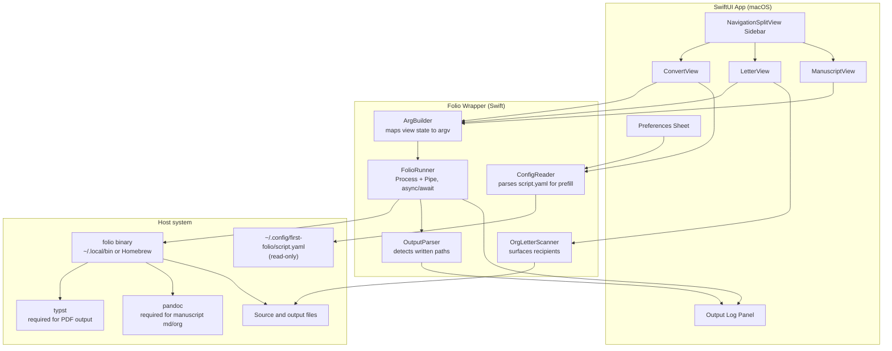

<!-- Version: 0.1 | Last updated: 2026-07-19 | Status: proposal, not implemented -->

# First Folio - SwiftUI Companion App: UX Proposal

## Purpose

A native macOS companion app that wraps the `folio` CLI and gives writers who are not comfortable with terminals access to the three commands (`convert`, `letter`, `manuscript`) through a graphical interface. The CLI remains authoritative; the app is a window onto it.

This proposal covers layout, interaction, and the runtime architecture that connects SwiftUI views to the `folio` binary. It does not cover build/packaging (signing, notarization, App Store vs direct distribution), preview rendering, or in-app editing - those are separate decisions.

## Core principle

**The app is an abstraction layer over the CLI. It offers no capability the `folio` CLI cannot perform.** If a workflow requires new behaviour, the CLI grows first and the app catches up. This keeps the CLI authoritative, makes every app action reproducible on the command line, and prevents the two surfaces from drifting. Wherever the app appears to add something (recipient list, YAML editing, PDF auto-open), it is only presenting existing CLI capability in a friendlier form, or performing OS-level actions (Finder reveal, Preview open) that are not `folio`'s job.

## Scope and non-goals

**In scope**
- File selection (single or multiple depending on command)
- Style selection where applicable (`british` / `us` / `screenplay`)
- Output target selection (save-as, output directory, or stdout preview)
- Invocation of `folio` as a subprocess with the correct arguments
- Presenting progress, output paths, and errors

**Out of scope**
- In-app text editing of source files
- Live PDF preview (Vision mentions it as a future goal; treat as a follow-up)
- Config file editing in MVP - the app reads config, it does not yet write to `script.yaml`. A structured YAML editor is planned for a later release; see §Preferences (post-MVP).
- Reimplementing any parsing/rendering in Swift; all conversion goes through `folio`

## The three paradigms

The commands have genuinely different shapes. The UI must reflect that rather than force a uniform "pick a file, press Convert" flow.

| Command | Input | Output | Style options | Distinctive UX need |
|---|---|---|---|---|
| `convert` | One script file (`.org` / `.md` / `.fountain`) | One file (any of the above plus `.pdf`) or stdout | `british` (British Stageplay, default) / `us` (US Stageplay) / `screenplay` (industry-standard screenplay, nation-agnostic) | Target format picker; layout knobs behind a disclosure; open produced PDF in Preview on success |
| `letter` | One `.org` file containing `:letter:` sections | N PDFs, one per recipient, into a chosen directory | none | Recipient list surfaced from the source file; per-recipient toggles; prefix and directory |
| `manuscript` | Many prose files (`.md` / `.org`), possibly a glob | One `.typ` or `.pdf` file | `british` (default) / `us` only - no screenplay | Ordered multi-file list, drag to reorder; metadata overrides form; dry-run |

The style options are asymmetric on purpose:

- `convert` has three styles: **British Stageplay**, **US Stageplay**, and **Screenplay**. Stageplay layout differs by nation (typography, title-page conventions), which is why British and US are distinct. Screenplay is a single industry-standard format (Courier Prime, standard title-page conventions) that applies regardless of nation - there is no "British Screenplay" and none is intended. Verified in `internal/config/config.go:65-80` and `presets/us-screenplay-overrides.yaml`.
- `manuscript` has two because "screenplay" is a script format and does not apply to prose. Prose manuscripts vary only by nation.
- `letter` has no style flag at all; letters use one layout (see `docs/config.md` §Letter settings).

The UI must not offer options the CLI would reject.

## Layout

A macOS `NavigationSplitView` with a fixed three-item sidebar. Each item is one command. The detail pane is the workspace for that command.

```
+-----------------------------------------------------------------+
|  First Folio                                             [ ⚙ ]  |
+-----------+-----------------------------------------------------+
|           |                                                     |
|  Sidebar  |            Detail pane (per command)                |
|           |                                                     |
|  Convert  |                                                     |
|  Letter   |                                                     |
|  Manuscript                                                     |
|           |                                                     |
|           |            [ Run ]           Output log             |
+-----------+-----------------------------------------------------+
```

Rationale:

- Sidebar is the mac-native pattern for a small number of top-level modes.
- Each mode's detail pane is tailored to its paradigm - no forced uniformity.
- A shared bottom strip carries the primary action (`Run`) and a collapsible output log.
- Preferences (`⚙`) opens a sheet for config discovery (see §Configuration).

An alternative "task chooser" landing page (three big cards) was considered for approachability but was rejected as primary: a persistent sidebar lets the user switch modes mid-task without losing context, and matches macOS Mail / Notes / Music conventions playwrights will already recognize.

## Screen: Convert

Purpose: run `folio convert <source> [target] [--style ...] [--to ...]`.

Fields:

- **Source file** - single-file picker (`.org`, `.md`, `.fountain`). Shows filename and full path below the field.
- **Output** - segmented control: `Save as file` | `Preview as text`.
  - `Save as file` reveals a save-as picker and infers target format from extension (matches CLI behaviour).
  - `Preview as text` reveals a format picker (`org` / `md` / `fountain` - no `pdf` for stdout), and renders output into the log area rather than to disk.
- **Style** - segmented control: `British Stageplay` (default) | `US Stageplay` | `Screenplay`. Screenplay is nation-agnostic (one industry-standard layout for both geographies).
- **PDF layout** - disclosure group, only enabled when target is `.pdf`. Contains: `Font`, `Font size`, `Margin`, `Page size`, `Dialogue indent`, `Dialogue spacing`, `Direction spacing`, plus two toggles for `Italic directions` and `Centre directions`. These map 1:1 to the `--font`, `--font-size`, `--margin`, `--page`, `--indent`, `--dialogue-spacing`, `--direction-spacing`, `--[no-]direction-italic`, `--[no-]direction-centre` CLI flags. Fields left blank are omitted from the invocation so config-file values apply.

Primary action: `Convert`.

On success, if the produced target is a `.pdf`, the app opens it in macOS Preview automatically (via `NSWorkspace.shared.open(_:)`). For text targets it reveals the file in Finder; for `Preview as text` mode the output is already visible in the log. Auto-open is a preference (default on) so users doing batch work can disable it.

## Screen: Letter

Purpose: run `folio letter <source.org> [--to REGEX] [--dir DIR] [--prefix PREFIX]`.

Fields:

- **Source file** - single-file picker restricted to `.org`.
- **Recipients** - a table populated by scanning the source file for `:to:` H4 headings under `:letter:` sections. Each row has a checkbox and shows the recipient name and any resolved tags. Selecting a subset builds a `--to` regex of the form `^(A|B|C)$` (escaped). If all are ticked the app omits `--to` entirely.
- **Output directory** - directory picker; defaults to the source file's directory (matches CLI default).
- **Filename prefix** - text field; default `letter` (matches CLI default).

Primary action: `Generate Letters`. The log lists the PDFs written, one per recipient.

Notes and gaps:

- Recipient discovery requires the app to parse enough of the org file to list `:letter:` recipients. Two options: (a) do a minimal Swift-side parse of `**** Name :tag:` headings; (b) add a `folio letter --list` subcommand upstream. Option (b) is cleaner but requires a CLI change; option (a) is fine for a first pass provided the parser is documented as a mirror of the org format rules in `docs/format-org.md`.

## Screen: Manuscript

Purpose: run `folio manuscript <input>... <target> [--style ...] [metadata overrides]`.

Fields:

- **Input files** - multi-file picker (`.md`, `.org`). Chosen files appear in a reorderable list with drag handles - order is significant to the CLI. A `Add glob...` button opens a small sheet where the user can enter a shell glob (e.g. `~/notes/about-time-nove/part?/ch??.md`), and the app expands it and appends the matches; this preserves the CLI's globbing use case for users who prefer patterns.
- **Target file** - save-as picker with `.typ` or `.pdf` selection.
- **Style** - segmented control: `British` (default) | `US`. No screenplay option.
- **Metadata overrides** - disclosure group. Fields: `Title`, `Subtitle`, `Author`, `Attribution` (prefix, e.g. "by"), `Date`, `Version`, `Wordcount`, `Contact name`. Blanks are omitted from the invocation so `script.yaml` and source frontmatter still apply. Maps to the `--title` / `--subtitle` / `--author` / `--attribution` / `--date` / `--version` / `--wordcount` / `--contact-name` CLI flags.
- **Dry run** - checkbox. When ticked, adds `--dry-run` and shows the render plan in the log without producing output.

Primary action: `Render Manuscript`.

## Shared UI concerns

- **Output log**: a monospace scrolling text area at the bottom of every detail pane. Streams stdout and stderr from `folio`. On success, shows a `Reveal in Finder` button for each output path detected, and an `Open in Preview` button next to any `.pdf` (Convert auto-opens; Letter and Manuscript require the click).
- **Errors**: non-zero exit codes surface an alert with the last stderr line as the title and the full stderr in a "Show details" disclosure.
- **Cancellation**: `Run` becomes `Cancel` while a subprocess is active and sends SIGTERM.
- **Recent files**: each command remembers its last N inputs in `UserDefaults`, keyed by command. No cross-command sharing (the source formats overlap but the intent does not).
- **Drag-and-drop**: dragging a file onto the sidebar selects the appropriate mode by extension (`.fountain` → Convert, multiple `.md` → Manuscript, single `.org` → last-used of Convert/Letter/Manuscript). This is a convenience, not a substitute for the picker.

## Configuration

The app does not write config files (matches the CLI contract in `docs/config.md`). It does:

- Read `~/.config/first-folio/script.yaml` at launch, if present, to prefill default style, font, and page size in the Convert screen.
- Show the resolved config sources in a Preferences sheet (`⚙`): global path, local path (if a source file is loaded), and the CLI overrides that will be added by the app's current field values. This is a diagnostic aid so a writer can see why an output looks the way it does.

The app never edits `script.yaml` in MVP. Users who want a persistent change edit the file themselves; the app rereads it on next launch or when explicitly refreshed.

## Preferences (post-MVP)

**Status:** design captured now for direction, not scoped for the first release. MVP treats `script.yaml` as read-only.

The Preferences pane is a structured YAML editor for the `folio:` namespace. It is not a free-text editor - the app writes valid YAML back to disk on save, and each field is constrained to values the CLI accepts.

### Scope toggle

At the top of the pane, a two-position toggle:

- **Prefs for this doc set** - enabled only when a source file (Convert / Letter) or set of source files (Manuscript) is currently loaded. Edits the local `script.yaml` in the source file's directory. If none exists, `Save` creates one containing only the keys the user has set - it does not copy the merged config into a new file (that would freeze defaults and defeat inheritance).
- **Default config** - always enabled. Edits `~/.config/first-folio/script.yaml`. Same principle: writes only the keys the user has actually set.

The toggle also changes the "resolved value" annotation next to each field so the user can see which layer wins after their edit (see §Field rows).

### Layout

The pane is a scroll view of collapsible blocks matching the config schema in `docs/config.md`:

- **Shared metadata** (`title`, `subtitle`, `author`, `date`, `version`)
- **Shared rendering options** (`render.*` toggles)
- **PDF settings** (`folio.font`, `folio.font-size`, `folio.margin`, `folio.page`, `folio.style`, `folio.default-format`)
- **Title page** (`folio.title-page.*`)
- **Positioning** (`folio.positioning.*`, itself nested: `speech`, `stage-direction`, `transition`, headers)
- **Letter** (`folio.letter.*`)
- **Manuscript** (`folio.manuscript.*`, with sub-blocks for `page-header`, `toc`, and its own overrides)

Each block header is a `DisclosureGroup`. All blocks are collapsed by default; the user opens the ones they want. Opening a block reveals its field rows underneath. Nested blocks (e.g. `folio.positioning.speech`) render as nested disclosure groups.

### Field rows

Each field row shows:

- The dotted key (e.g. `folio.positioning.speech.speaker.case`)
- A control appropriate to the field's type, with **dropdown options** wherever the CLI accepts a fixed set:
  - Enums (`style`, `page`, `case`, `alignment`, `position`) → `Picker` with the CLI-accepted values
  - Booleans (`render.*`, `direction-italic`, `direction-centre`) → `Toggle`
  - Sizes (`font-size`, `margin`, `indent`) → text field with a dropdown of common values (`10pt`, `11pt`, `12pt`; `20mm`, `25mm`, `30mm`) plus free text for anything else
  - Fonts → text field with a dropdown of fonts installed on the system that Typst can see
  - Free-form strings (`title`, `author`) → plain text field
- A subtle secondary line showing the resolved value under the current scope, and which layer it came from (`from global`, `from local`, `from built-in`) - so users can tell whether their edit will actually take effect.
- A revert-to-inherited affordance (small `↺` icon) that removes the key from this scope and lets a lower layer win again.

### Validation

The editor validates and rejects invalid config before writing to disk. No `Save` action can produce a `script.yaml` that `folio` would refuse to load.

- Enum fields are constrained at the control level - a dropdown cannot yield an out-of-set value.
- Size fields (`font-size`, `margin`, `indent`) are validated against Typst's length syntax; anything typed free-form is checked before save.
- Cross-field constraints (for example, `folio.style: screenplay` disabling `folio.positioning.speech.speaker.case` if the screenplay preset pins it) are surfaced as inline warnings, not silent overrides.
- The final gate is a dry-run: on `Save`, the app writes the candidate YAML to a temporary file and invokes `folio` in a validate-only mode against it. If the CLI rejects the file, the app shows the CLI's error, does not touch the real `script.yaml`, and keeps the pane in edit state. This requires a validate-only mode on the CLI (e.g. `folio config --validate PATH`); see Open Question 6.
- Malformed YAML that reaches the editor (from an external edit) is displayed with the parser's line/column error and the pane refuses to enter edit mode until the user either fixes the file externally or discards changes.

### Save behaviour

- `Save` writes only the keys the user has touched, using `gopkg.in/yaml.v3`-compatible output. The app preserves any keys it does not recognize (forward compatibility with future `folio` versions and with the shared `yapper:` namespace).
- The app never touches `yapper:` blocks.
- On save, the app re-reads the resolved config so all displayed "resolved value" lines refresh.

### Why this is post-MVP

- The MVP already delivers file selection, style choice, and one-click conversion, which is the Vision doc's stated bar.
- A structured YAML editor with per-field vocabularies needs a schema source (see Open Question 6). Hand-maintaining one in Swift is possible but is an ongoing sync burden.
- Editing shared config while the CLI is the source of truth is a legitimate contract change (see `docs/config.md`: "First Folio ... never creates, modifies, or writes to config files"). That contract needs to be revisited before the app writes to `script.yaml`.

## Architecture

The app is a thin SwiftUI shell over the `folio` subprocess. No conversion or rendering logic is duplicated in Swift.



Key points:

- **`FolioRunner`** is the only place that spawns processes. It takes `argv`, streams stdout/stderr through async sequences, and returns an exit status. All three views funnel through it.
- **`ArgBuilder`** is per-command. It converts view state into a validated `[String]` argv. Blank fields are omitted rather than passed as empty strings, so CLI defaults and config files still apply.
- **`OrgLetterScanner`** is the only Swift-side "parser" and it is deliberately shallow: enough to list recipient headings, not to interpret letter bodies. Full interpretation stays in `folio letter`.
- **`ConfigReader`** is read-only and returns a struct suitable for prefill. It never writes.
- **`OutputParser`** watches stderr/stdout for the "wrote X" lines emitted by `folio` and turns them into clickable Reveal-in-Finder rows in the log.

The binary is discovered by, in order: bundled path (if we ship one), `~/.local/bin/folio`, Homebrew paths, `PATH`. If none is found, the app shows a first-run sheet with install instructions and a `Choose folio binary...` picker.

## Open questions

1. **Recipient listing** - parse in Swift, or add `folio letter --list` to the CLI? Cleaner upstream, but adds surface area.
2. **Preview** - the Vision doc mentions live-rendered preview as a future goal. Do we ship the app without it, or block on a PDF preview implementation? A first release without preview is honest to scope; a `Preview as text` mode on the Convert screen is a low-cost partial step. Auto-opening the produced PDF in macOS Preview covers the "see the result immediately" need without embedding a preview surface.
3. **Landing page vs sidebar** - the sidebar is proposed as primary; is a landing page needed for first-run guidance, or does a first-run sheet inside the Convert view suffice?
4. **App discovery of Typst/Pandoc** - if `folio` exits with a "typst not found" error, should the app offer install guidance (e.g. brew commands) or just relay the error? Relaying is safer; guidance risks going stale.
5. **Sandboxing** - full sandboxing constrains subprocess execution and PATH lookups. Decide early whether the app is distributed via App Store (sandbox mandatory) or direct download (sandbox optional). This shapes how `FolioRunner` locates the binary.
6. **CLI additions needed by the post-MVP Preferences pane** - the structured YAML editor needs two things from the CLI: (a) a machine-readable schema of allowed values per key (e.g. `folio config --schema` emitting JSON) to drive dropdown vocabularies without hand-maintained Swift duplicates; (b) a validate-only mode (e.g. `folio config --validate PATH`) that checks a candidate `script.yaml` and exits non-zero with a descriptive error, so the app can gate `Save`. Both preserve the "no capability the CLI cannot perform" principle by keeping validation authoritative in `folio`.

## What this proposal does not commit to

- Any Swift package layout, module boundaries, or test approach - those belong in an implementation plan, not this UX doc.
- Specific control types beyond what SwiftUI provides out of the box (`Picker`, `Toggle`, `List`, `DisclosureGroup`, `fileImporter`, `fileExporter`).
- A colour scheme, iconography, or branding treatment.
